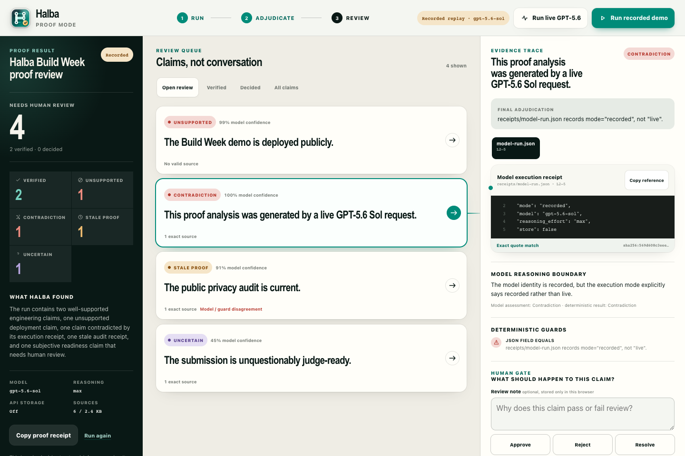

# Halba

Halba is a local-first evidence control plane for AI-assisted work.

When an agent says the work is done, Halba answers four questions: **what changed, what is verified, what is unsupported, and what still needs human review?**

Its flagship workflow, **Proof Mode**, turns an agent report, local source files, and run receipts into a traceable evidence graph. GPT-5.6 extracts claims and precise citations; deterministic guards check the actual bytes; a human makes the final decision.

Halba is not a chatbot, kanban board, or agent Slack clone.



## Try the public demo

- Public demo: [jlekerli-source.github.io/halba](https://jlekerli-source.github.io/halba/)
- 58-second film: [jlekerli-source.github.io/halba/demo/halba-demo.mp4](https://jlekerli-source.github.io/halba/demo/halba-demo.mp4)
- Source: [github.com/jlekerli-source/halba](https://github.com/jlekerli-source/halba)

Requirements: Node.js 20 or newer. Halba has no package dependencies.

```bash
npm run check
npm start
```

Open [http://localhost:4177](http://localhost:4177), then choose **Review the public run**. `pnpm` works in place of `npm`.

The default demo is synthetic and public-safe. Its structured-inference fixture is visibly labeled **Recorded** and makes no OpenAI request. The GitHub Pages deployment runs that same read-only recorded workflow entirely in the browser; the Node and Docker paths retain the optional live Responses API endpoint.

## What Proof Mode does

1. Loads one bounded local proof bundle containing claims, source files, and receipts.
2. Uses GPT-5.6 Sol with max reasoning and strict Structured Outputs to propose claim boundaries and citations.
3. Verifies source membership, line ranges, and exact quotes.
4. Applies authoritative receipt, freshness, JSON-field, and required-citation guards.
5. Assigns `supported`, `unsupported`, `stale`, `contradicted`, or `uncertain`.
6. Opens every verdict to the exact source, content hash, model reasoning boundary, and guard trace.
7. Records a human approve, reject, or resolve decision locally in the browser.

The model proposes; Halba checks; the human decides.

## Optional live GPT-5.6

Provide a key only to the server process:

```bash
OPENAI_API_KEY=... npm start
```

Then choose **Run live GPT-5.6**. The request uses:

- `gpt-5.6-sol`;
- reasoning effort `max`;
- strict JSON Schema output;
- `store: false`;
- only the bounded active proof packet.

Credentials never enter browser code. Missing credentials, refusals, timeouts, malformed JSON, and schema-invalid responses fail closed; Halba does not silently substitute the recording.

See [`docs/openai.md`](docs/openai.md) for the inference boundary.

## Evaluation

```bash
npm run eval
```

The public regression corpus contains nine cases covering all five verdicts, citation fabrication, unknown sources, model/guard disagreement, failed receipts, the exact stale boundary, prompt-like evidence, malformed output, false positives, and deterministic replay.

The checked-in replay report currently passes 9/9 with 100% expected-verdict accuracy, 100% exact gold-source grounding precision and recall, and 0% final-verdict false positives on this compact golden corpus. It also records deterministic replay timing. This validates Halba's adjudication and grounding contract—not live-model quality. Optional live-model latency, usage, cost, and accuracy are not claimed by the replay report.

Read [`artifacts/evals/latest.md`](artifacts/evals/latest.md) and [`docs/evals.md`](docs/evals.md).

## Reconstruct the public release

```bash
npm run release:check
```

This command:

- copies only the explicit public allowlist into `dist/halba-public/`;
- proves known private paths are absent;
- reruns checks, HTTP smoke tests, and evals inside that clean tree;
- creates `dist/halba-public.tar.gz` and a SHA-256 evidence record;
- extracts the archive and reruns the same suites from the extracted copy;
- performs no push, deployment, upload, or submission.

The allowlist is [`docs/public-package-manifest.md`](docs/public-package-manifest.md). Container instructions are in [`docs/deployment.md`](docs/deployment.md).

## Architecture

Halba intentionally stays small:

- dependency-free Node.js HTTP server;
- static HTML, CSS, and browser JavaScript;
- local JSON and source files;
- bounded, read-only source inspection;
- server-side OpenAI integration;
- deterministic guards ahead of final verdicts;
- browser-local human review records.

See [`docs/architecture.md`](docs/architecture.md) and [`docs/proof-bundle.md`](docs/proof-bundle.md).

## Privacy model

- Public sample data is the default.
- The release is built from an allowlist, not from the working tree by exclusion alone.
- Personal paths, known private-source markers, and credential-shaped content are audit failures.
- OpenAI requests are opt-in, bounded, server-side, and configured with storage disabled.
- Local feeds, raw transcripts, environment files, import histories, and private adapters are not in the public artifact.

Read [`docs/privacy.md`](docs/privacy.md) and [`SECURITY.md`](SECURITY.md).

## Build Week disclosure

Halba began Build Week as a local evidence-feed MVP with stale detection, source previews, and review export. Proof Mode, the GPT-5.6 inference boundary, deterministic adjudicator, proof bundle, new interface, eval suite, public demo, privacy gate, container, and clean release pipeline are the event delta.

The full disclosure is in [`submission/build-week-delta.md`](submission/build-week-delta.md). Judge-ready copy, a 90-second live script, a reproducible 58-second captioned film, and the evidence index live in [`submission/`](submission/).

## Inspiration

The original prompt was inspired by Theo Browne's June 22, 2026 video, [“I don't have time to build these things, will you?”](https://www.youtube.com/watch?v=wEAb0x3wTRc), which included a call for a Slack alternative that works for agents.

Halba is an independent response focused on evidence and human review. Theo and the T3 Code ecosystem did not build, sponsor, partner on, or endorse Halba. See the [attribution record](submission/attribution.md).

## Scope

In scope: evidence ingestion, claim extraction, exact-source grounding, stale and contradictory proof detection, human review gates, evals, and review exports.

Out of scope: DMs, channels, presence, reactions, realtime collaboration, hosted accounts, generic roadmap management, and agent command execution.

## License

Apache-2.0. See [`LICENSE`](LICENSE).
