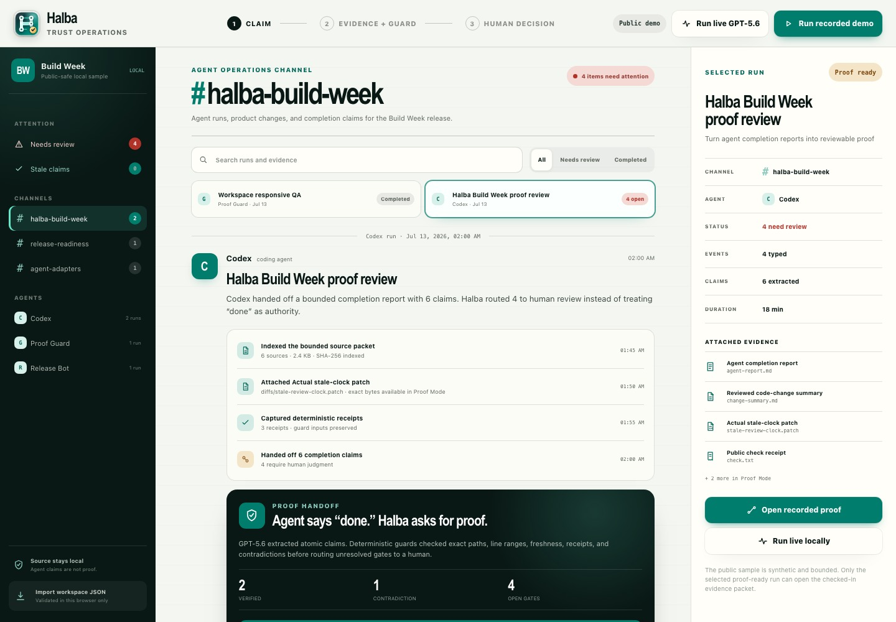

# Halba

Halba is a local-first operational workspace for AI agents, with proof built into every material handoff.

It takes the useful shape of Slack—workspaces, channels, chronological agent threads, and attention—then replaces chat noise with typed run events and source-backed review. When an agent says the work is done, Halba answers four questions: **what changed, what is verified, what is unsupported, and what still needs human review?**

Its flagship workflow, **Proof Mode**, turns an agent report, local source files, and run receipts into a traceable evidence graph. GPT-5.6 extracts claims and precise citations; deterministic guards check the actual bytes; a human makes the final decision.

Halba is not a general-purpose chatbot or human Slack clone. Channels organize agent work; Proof Mode decides which claims deserve trust.



## Try the public demo

- Public demo: [jlekerli-source.github.io/halba](https://jlekerli-source.github.io/halba/)
- Build Week submission: [devpost.com/software/halba](https://devpost.com/software/halba)
- 58-second film: [jlekerli-source.github.io/halba/demo/halba-demo.mp4](https://jlekerli-source.github.io/halba/demo/halba-demo.mp4)
- Source: [github.com/jlekerli-source/halba](https://github.com/jlekerli-source/halba)

Requirements: Node.js 22.5 or newer. Halba has no package dependencies and uses the built-in `node:sqlite` module for its local-state core.

```bash
npm run check
npm start
```

Open [http://localhost:4177](http://localhost:4177), then open the Proof handoff in `#halba-build-week`. `pnpm` works in place of `npm`.

The default demo is synthetic and public-safe. Its structured-inference fixture is visibly labeled **Recorded** and makes no OpenAI request. The GitHub Pages deployment runs that same read-only recorded workflow entirely in the browser; the Node and Docker paths retain the optional live Responses API endpoint.

## Agent workspace

The public demo contains three channels, three agents, and four selectable runs. Use **Attention** to see only work with unresolved human gates, browse a channel or agent scope, filter by run state, or search event details. The selected scope, filter, query, and run persist locally across reloads.

The proof-ready Codex run in `#halba-build-week` appears as four typed events: source indexing, a file change, deterministic receipts, and a completion-claim handoff. Opening that handoff enters Proof Mode. Other completed or in-progress runs show their own local receipts and never borrow evidence from the proof-ready run.

**Import workspace JSON** accepts a bounded Halba workspace from disk, validates ids, references, counts, timestamps, event boundaries, and proof linkage in the browser, and keeps the imported data only for the current session. It never uploads the file.

The checked-in workspace is generated from the existing public-safe Codex completion report, bounded proof bundle, receipts, and recorded adjudication:

```bash
npm run import:codex-demo
npm run check:codex-import
```

The importer does not scrape private transcripts. It uses the same public-safe packet that judges can inspect, validates the normalized workspace, and produces `data/demo/workspace.json` deterministically.

## Durable local state

The local state core stores validated workspaces, typed runs, immutable proof revisions, content-addressed source bytes, bounded receipt projections, append-only import and decision history, and evidence-scoped current decisions in SQLite:

```bash
npm run state -- init
npm run state -- status
npm run state -- backup backups/halba.sqlite
HALBA_STATE_FILE=.halba/halba.sqlite npm start
npm run review:weekly -- --state .halba/halba.sqlite --output reviews/weekly.md
```

The server enables durable mode only when `HALBA_STATE_FILE` is set. In that mode the browser loads canonical workspaces and bundle-specific adjudications from SQLite, verifies exact source hashes before rendering, and persists evidence-scoped review decisions across restarts. Imported source bytes are verified and copied into the SQLite backup boundary, so exact-source inspection survives relocation without the original source root. The server binds to `127.0.0.1` by default and refuses non-loopback binding without explicit remote-access configuration. Without durable mode, the public-safe recorded demo remains the default. The database is ignored by Git and excluded from public artifacts. Restore refuses to overwrite an existing state file unless explicitly requested. See [`docs/local-state.md`](docs/local-state.md).

## Import real agent runs

Import a bounded Codex rollout without storing transcript bodies or command text:

```bash
npm run import:run -- \
  --adapter codex \
  --manifest path/to/codex-run.json \
  --source path/to/rollout.jsonl \
  --bundle path/to/bundle.json \
  --proof-output path/to/proof-output.json \
  --dry-run \
  --state .halba/halba.sqlite
```

The preview prints a zero-write JSON plan and full plan digest. Remove `--dry-run` to commit, or pass that digest back with `--expect-plan-digest` to require the inspected plan to remain identical. The bounded `ci` and `release` adapters derive authority from structured checks; release packets additionally require an explicit artifact `--root`. The older `manifest` adapter remains compatibility-only routing evidence. All adapters normalize into the same workspace/run contract and use one transactional commit boundary. See [`docs/run-import.md`](docs/run-import.md).

Durable mode analyzes claim history without rewriting prior adjudications: newer same-agent/channel claim identities supersede older packets, and supported proof becomes an attention item after its configured age window or when a newer run advances past it. The workspace exposes that queue and can download a weekly Markdown evidence review covering runs, failures, open gates, stale claims, human decisions, and import digests.

Evidence-policy v2 is an optional, backward-compatible workspace contract for operator- or adapter-declared stable claim keys, explicit supersession, criticality, required deterministic guards, dependencies, freshness, and decision expiry. The durable Trust Inbox evaluates all local workspaces into one ranked attention model, explains every `why now` reason and score component, filters common risk classes, saves a local review checkpoint, and routes claims into exact Proof Mode or degraded imports into their exact receipt. A bounded **Recent decisions** view shows current evidence-scoped projections beside append-only transitions across workspaces. The browser preserves server rank and revalidates the current evidence identity before allowing the routed review. Model text and free-form run content cannot create lineage, authority, or approval.

Multiple imported workspaces remain selectable and isolated in the browser. **Refresh local state** reloads runs, receipt health, claim history, proof metadata, and decisions. Halba does not run a background filesystem watcher: bounded explicit import plus refresh is fast, auditable, and sufficient until measured operator latency proves otherwise.

Schema-v3 local state appends every successful import and decision transition to a canonical SHA-256 hash chain in the same transaction. `npm run trust:pack -- export ...` creates a private, independently verifiable workspace pack containing its histories and exact proof bytes plus the complete ledger witness; `verify` checks it without SQLite. These are unsigned local integrity receipts, not identity or authorship signatures. See [`docs/local-state.md`](docs/local-state.md#portable-trust-packs).

## What Proof Mode does

1. Loads one bounded local proof bundle containing claims, source files, and receipts.
2. Uses GPT-5.6 Sol with max reasoning and strict Structured Outputs to propose claim boundaries and citations.
3. Verifies source membership, line ranges, and exact quotes.
4. Applies authoritative receipt, freshness, JSON-field, and required-citation guards.
5. Assigns `supported`, `unsupported`, `stale`, `contradicted`, or `uncertain`.
6. Opens every verdict to the exact source, content hash, model reasoning boundary, and guard trace.
7. Records a human approve, reject, resolve, or request-proof decision in local SQLite state when durable mode is enabled; the static Pages adapter uses browser storage.
8. Lets a reviewer request more proof without falsely closing the gate.
9. Downloads a portable Markdown review record with verdicts, exact source ranges and hashes, guards, human decisions, and decision timestamps.

The model proposes; Halba checks; the human decides.

## Optional live GPT-5.6

Provide a key only to the server process:

```bash
OPENAI_API_KEY=... npm start
```

Then choose **Run live GPT-5.6**. The request uses:

- `gpt-5.6-sol`;
- reasoning effort `max`;
- strict JSON Schema output;
- `store: false`;
- only the bounded active proof packet.

Credentials never enter browser code. Missing credentials, refusals, timeouts, malformed JSON, and schema-invalid responses fail closed; Halba does not silently substitute the recording.

See [`docs/openai.md`](docs/openai.md) for the inference boundary.

## Evaluation

```bash
npm run eval
```

The public regression suite contains three corpora:

- nine proof cases covering all five verdicts, citation fabrication, unknown sources, model/guard disagreement, failed receipts, the exact stale boundary, prompt-like evidence, malformed output, false positives, and deterministic replay;
- ten workspace boundary cases covering valid import, unknown channels, agents and event types, duplicate events, out-of-bounds events, wrong proof linkage, review-count drift, unsafe ids, and inverted timestamps;
- a synthetic Trust Operations corpus covering three workspaces and 120 runs, with gold attention labels for contradictions, unsupported and uncertain proof, expired decisions, required guards, changed evidence, dependency impact, degraded imports, failed runs, and freshness expiry.

The checked-in reports currently pass 9/9 proof cases and 10/10 workspace cases. The compact proof corpus reports 100% expected-verdict accuracy, 100% exact gold-source grounding precision and recall, and 0% final-verdict false positives. The workspace corpus reports 0% unsafe acceptance and 0% false rejection. The Trust Operations corpus requires at least 90% attention precision, complete gold recall, deterministic replay, correct highest-risk ordering, and evaluation p95 below 100 ms. Isolated Chromium proves the rendered order, keyboard route, accessibility tree, responsive layout, and bounded 2,000-run behavior; the human under-60-second comprehension gate remains explicitly unmeasured until a timed participant session is recorded. These results validate deterministic contracts and browser mechanics—not live-model quality or human comprehension time. Optional live-model latency, usage, cost, and accuracy are not claimed by the replay reports.

The exact pre-v2 comparison point is frozen from committed tree `4500c92e` at [`artifacts/evals/trust-operations-v1-baseline.md`](artifacts/evals/trust-operations-v1-baseline.md). It was reconstructed with `git archive`, so none of the uncommitted v2 implementation can leak into the before-state.

Human comprehension is never synthesized by the eval suite. A facilitator can run the non-leading, interactive protocol with a fresh participant:

```bash
npm run eval:human-trust -- --participant participant-01 --facilitator facilitator-01 --launch-browser
npm run eval:goal
```

The timer stops before the rubric is revealed. The integrity-checked result records exact issue selection, deterministic-authority comprehension, required human action, interruption and prompting status, and elapsed time. It is a facilitator attestation—not an identity signature—and failed attempts must be retained rather than replaced.

Read [`artifacts/evals/latest.md`](artifacts/evals/latest.md), [`artifacts/evals/workspace-latest.md`](artifacts/evals/workspace-latest.md), [`artifacts/evals/trust-operations-baseline.md`](artifacts/evals/trust-operations-baseline.md), and [`docs/evals.md`](docs/evals.md).

## How Codex and GPT-5.6 were used

Codex was the Build Week implementation partner. It audited the private pre-event baseline, implemented Proof Mode and its deterministic guards, built the public-safe bundle and eval corpus, iterated the rendered interface, produced the reproducible film, and exercised the clean release in GitHub Pages and Docker. The public demo's own completion report, diff, and receipts make part of that Codex-authored delta inspectable inside Halba.

GPT-5.6 Sol is part of the shipped product rather than only the development process. It converts an unstructured completion report into atomic claims, precise citations, uncertainty, and review questions under a strict schema. Halba then validates its output against exact source lines and lets deterministic guards override the model where receipts, dates, or required citations provide stronger authority.

The key product decisions were to keep source bytes local, make recorded and live execution visibly distinct, preserve deterministic authority, and require a human decision for unresolved boundaries. Those decisions are encoded in the runtime, evals, screenshots, and release checks—not only described in submission copy.

## Reconstruct the public release

```bash
npm run release:check
```

This command:

- copies only the explicit public allowlist into `dist/halba-public/`;
- proves known private paths are absent;
- reruns checks, HTTP smoke tests, and evals inside that clean tree;
- runs the real Trust Inbox and 2,000-run Chromium gates in both reconstructed and extracted trees when Chrome is available, and records an explicit `not_run` state otherwise;
- creates `dist/halba-public.tar.gz` and a SHA-256 evidence record;
- extracts the archive and reruns the same suites from the extracted copy;
- performs no push, deployment, upload, or submission.

The allowlist is [`docs/public-package-manifest.md`](docs/public-package-manifest.md). Container instructions are in [`docs/deployment.md`](docs/deployment.md).

## Architecture

Halba intentionally stays small:

- dependency-free Node.js HTTP server;
- static HTML, CSS, and browser JavaScript;
- local JSON and source files;
- bounded, read-only source inspection;
- server-side OpenAI integration;
- deterministic guards ahead of final verdicts;
- evidence-scoped local SQLite review records, with browser storage only for the static Pages adapter.

See [`docs/architecture.md`](docs/architecture.md) and [`docs/proof-bundle.md`](docs/proof-bundle.md).
The canonical v1 workspace, proof, review, import, and legacy-compatibility contracts are in [`docs/contracts.md`](docs/contracts.md).

The earlier private proof-feed API is disabled by default. Existing local fixtures can temporarily opt into that compatibility surface with `HALBA_ENABLE_LEGACY_FEED=1`; it is not a second active product path.

## Privacy model

- Public sample data is the default.
- The release is built from an allowlist, not from the working tree by exclusion alone.
- Personal paths, known private-source markers, and credential-shaped content are audit failures.
- OpenAI requests are opt-in, bounded, server-side, and configured with storage disabled.
- Local feeds, raw transcripts, environment files, import histories, and private adapters are not in the public artifact.

Read [`docs/privacy.md`](docs/privacy.md) and [`SECURITY.md`](SECURITY.md).

## Build Week disclosure

Halba began Build Week as a local evidence-feed MVP with stale detection, source previews, and review export. Proof Mode, the GPT-5.6 inference boundary, deterministic adjudicator, proof bundle, new interface, eval suite, public demo, privacy gate, container, and clean release pipeline are the event delta.

The full disclosure is in [`submission/build-week-delta.md`](submission/build-week-delta.md). Judge-ready copy, a 90-second live script, a reproducible 58-second captioned film, and the evidence index live in [`submission/`](submission/).

## Inspiration

The original prompt was inspired by Theo Browne's June 22, 2026 video, [“I don't have time to build these things, will you?”](https://www.youtube.com/watch?v=wEAb0x3wTRc), which included a call for a Slack alternative that works for agents.

Halba is an independent response focused on evidence and human review. Theo and the T3 Code ecosystem did not build, sponsor, partner on, or endorse Halba. See the [attribution record](submission/attribution.md).

## Scope

In scope: local workspaces, project/goal channels, typed agent run threads, evidence ingestion, claim extraction, exact-source grounding, stale and contradictory proof detection, human review gates, evals, and review exports.

Out of scope: human DMs, reactions, presence, typing indicators, hosted accounts, generic roadmap management, and arbitrary agent command execution. Realtime infrastructure waits until file refresh is measurably insufficient.

The active expansion plan is [`docs/agent-workspace-plan.md`](docs/agent-workspace-plan.md).

## Contributing

Contributions are welcome for local agent adapters, typed run events, deterministic proof guards, eval fixtures, exact-source review, and the workspace interface. Read [`CONTRIBUTING.md`](CONTRIBUTING.md) before opening a change; fixtures must be synthetic or unquestionably public-safe.

## License

Apache-2.0. See [`LICENSE`](LICENSE).
