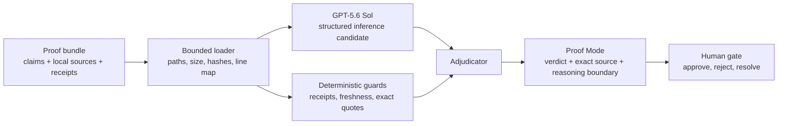

# Architecture

Halba is a local-first proof boundary between an agent's completion report and a human decision.

## Runtime shape

- `src/server.js` is a dependency-free Node.js HTTP server. It serves the static interface and a small proof API.
- `src/proof/bundle.js` loads one bounded bundle, resolves only declared relative files, rejects symlinks and traversal, records line maps, and hashes source bytes.
- `src/proof/openai.js` calls the Responses API from the server. The request selects `gpt-5.6-sol`, max reasoning effort, strict Structured Outputs, and `store: false`.
- `src/proof/engine.js` validates model citations and applies deterministic guards. A model conclusion cannot overrule a failed receipt, missing citation, stale source, or exact-quote mismatch.
- `public/` is a small browser application. Review decisions stay in browser local storage; no account or hosted database is required.

## Verdict precedence

The adjudicator uses the strongest applicable state:

1. `contradicted`
2. `unsupported`
3. `stale`
4. `uncertain`
5. `supported`

This order is intentional. A fresh model citation cannot soften a deterministic contradiction, and a model's doubt cannot hide deterministic support. Guard evidence and quote-validation findings remain visible in the trace.

## API

- `GET /api/proof/bundle` returns public metadata for the active proof bundle.
- `POST /api/proof/run` runs `recorded` or `live` inference, then deterministic adjudication.
- `GET /api/proof/source` returns an exact declared source range and its content hash.

Request bodies and source files have explicit limits. Source paths must be relative and contained inside the bundle root.

## Trust boundary

Model output is untrusted structured input. Halba validates its schema, source membership, line bounds, and quoted text before the result enters the review queue. Prompt-like text inside evidence remains evidence; it is never treated as an instruction. The user's final review decision is separate from the model and guard results.
