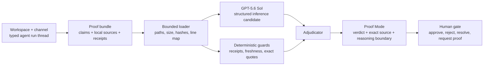

# Architecture

Halba is a local-first proof boundary between an agent's completion report and a human decision.

## Runtime shape

- `src/server.js` is a dependency-free Node.js HTTP server. It serves the static interface and a small proof API.
- `public/shared/workspace-contract.js` is the canonical browser-safe validator for bounded workspace, channel, agent, thread, review-evidence, and typed-event records. `src/domain/workspace.js` owns file loading and size limits; browser import uses the same validator rather than maintaining a second schema.
- `src/importers/codex-proof.js` converts the public-safe Codex completion packet and adjudication into that workspace contract. `npm run import:codex-demo` reproduces the checked-in fixture.
- `src/importers/codex-session.js`, `ci-manifest.js`, and `release-manifest.js` are bounded, source-specific inspectors. `adapter-contract.js` owns their shared deterministic preview and commit protocol; `run-manifest.js` supplies operator routing and canonical workspace normalization. Preview is zero-write and read-only against existing state. Commit revalidates source identity and enforces the previewed workspace digest inside the SQLite transaction.
- `src/proof/bundle.js` loads one bounded bundle, resolves only declared relative files, rejects symlinks and traversal, records line maps, and hashes source bytes.
- `src/proof/openai.js` calls the Responses API from the server. The request selects `gpt-5.6-sol`, max reasoning effort, strict Structured Outputs, and `store: false`.
- `src/proof/engine.js` validates model citations and applies deterministic guards. A model conclusion cannot overrule a failed receipt, missing citation, stale source, or exact-quote mismatch.
- `src/storage/local-store.js` owns the dependency-free SQLite state boundary: backward-compatible migrations, canonical workspace/run projections, immutable proof revisions, content-addressed source objects, append-only import and decision history, current decision projections, integrity checks, private backups, and relocated restore.
- `src/domain/claim-history.js` compares adjudicated claims across stored runs. It marks older same-agent/channel claim identities superseded and raises a fresh-proof attention item when supported evidence ages out or a newer run advances past it.
- `src/proof/engine.js` records model inference separately from final authority. A deterministic guard may settle a verdict; model-only output is retained as inspectable inference but fails closed to `uncertain` with review required.
- `public/shared/trust-contract.js` validates optional evidence-policy v2 metadata, explicit claim lineage, criticality, guard requirements, and acyclic dependency edges at the shared browser/Node boundary. `src/domain/trust-operations.js` evaluates those declarations across local workspaces and emits ranked attention with decomposed deterministic reasons.
- `public/` is a small browser application. In durable mode, its cross-workspace Trust Inbox consumes the bounded server read model, preserves API rank, explains each priority component, and routes an evidence-scoped claim target into exact Proof Mode. It also supports workspace-local attention, channel, and agent scopes; run search and filtering; selected-run inspection; and bounded browser-local workspace import. UI preferences and the review checkpoint stay in browser storage. Evidence-scoped decisions hydrate from and persist to SQLite; the static Pages adapter uses browser storage and does not expose Trust Inbox. Imported workspace files remain session-only. No account or hosted database is required.
- Durable mode lists and switches among local workspaces, shows bounded import receipt health, and refreshes state explicitly. A filesystem watcher is intentionally absent: the measured 2,000-run validate/import path is far below the five-second budget, and no daily-loop evidence currently justifies persistent background observation. The browser renders at most the newest 100 matching run-index buttons and requires search/filter narrowing for the rest.
- `public/workspace-import.js` revalidates imported workspaces at the browser boundary instead of trusting file contents. `public/workspace-state.js` keeps review-gate transitions explicit: requesting proof leaves a gate open, while approve, reject, and resolve close it.
- `public/shared/review-contract.js` namespaces every human decision by workspace, thread, bundle, claim, and evidence identity. A changed verdict, exact range, path, or source hash makes an older decision inapplicable and reopens the gate.
- The workspace shell presents four distinct runs across three channels and three agents, then routes only the proof-ready run into the existing Proof Mode workflow. Other runs expose their own receipts without borrowing proof. The shell does not create a second proof engine or trust path.
- `scripts/build-pages.mjs` creates a read-only static deployment from the already validated public bundle and recorded proof. It preserves the same source hashes, line maps, verdicts, and review UI while omitting the server-only live endpoint.
- The pre-workspace feed, roadmap, import-delta, and source-preview endpoints are compatibility-only and require `HALBA_ENABLE_LEGACY_FEED=1`. They are not reachable from the default v1 runtime.

## Verdict precedence

The adjudicator uses the strongest applicable state:

1. `contradicted`
2. `unsupported`
3. `stale`
4. `uncertain`
5. `supported`

This order is intentional. A fresh model citation cannot soften a deterministic contradiction, and a model's doubt cannot hide deterministic support. Guard evidence and quote-validation findings remain visible in the trace.

## API

- `GET /api/runtime` reports whether explicit durable state is enabled.
- `GET /api/workspaces` lists stored workspace identities; `GET /api/workspace?workspaceId=…` returns one validated workspace and its typed runs.
- `GET /api/proof/bundle?bundleId=…` returns metadata for exactly one stored bundle.
- `POST /api/proof/run` returns that bundle's stored adjudication in durable mode, or runs the public `recorded`/optional `live` path in demo mode.
- `GET /api/proof/source?bundleId=…&path=…` verifies the declared byte count, SHA-256 hash, line map, and requested range before returning source text.
- `GET /api/review-decisions`, `PUT /api/review-decision`, and `DELETE /api/review-decision` hydrate and persist evidence-scoped human decisions.
- `GET /api/claim-history?workspaceId=…` returns current, stale, and superseded claim observations with deterministic reasons.
- `GET /api/import-receipt?workspaceId=…&receiptId=…` resolves one exact bounded receipt, including append-only commit time, without exposing raw source bodies.
- `GET /api/recent-decisions?limit=…` returns a bounded cross-workspace composition of current evidence-scoped decisions and append-only transition history.
- `GET /api/weekly-review?workspaceId=…` composes canonical runs, claim history, decisions, and import receipts as JSON or downloadable Markdown.
- `GET /api/trust-operations?at=…&checkpointAt=…&limit=…` evaluates every local workspace into one deterministic attention read model, then returns a bounded top-N page with structured claim/run/import targets and inspectable priority components. `subjectUpdatedSinceCheckpoint` means the underlying thread timestamp advanced; it does not claim that the reason itself first emerged after the checkpoint.

Request bodies and source files have explicit limits. Source paths must be declared, relative, contained inside the bundle root, and unchanged from their imported identity. New durable imports verify and copy source bytes into the SQLite object vault before committing; exact-source reads prefer that content-addressed copy and recheck its hash. Durable endpoints exist only when `HALBA_STATE_FILE` explicitly points at local state. The server binds to loopback by default, rejects cross-site state changes, and requires explicit remote binding plus an origin allowlist when an operator deliberately exposes it.

The GitHub Pages artifact is a deployment adapter for the recorded public demo, not a second product path. Its `static-demo.json` is generated by the same loader and adjudicator used by the Node API; the interface exposes the static boundary and fails closed if a visitor asks for live inference.

## Trust boundary

Model output and imported workspace JSON are untrusted structured input. Halba validates model schema, source membership, line bounds, quoted text, workspace references, counts, timestamp ordering, and proof linkage before data enters the review queue. Prompt-like text inside evidence remains evidence; it is never treated as an instruction. The user's final review decision is separate from the model and guard results.
