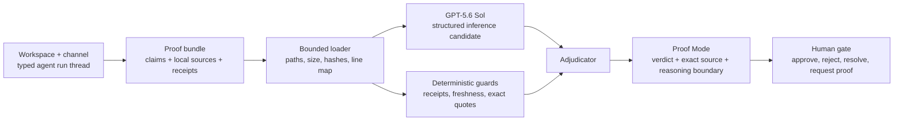

# Architecture

Halba is a local-first proof boundary between an agent's completion report and a human decision.

## Runtime shape

- `src/server.js` is a dependency-free Node.js HTTP server. It serves the static interface and a small proof API.
- `src/domain/workspace.js` validates bounded workspace, channel, agent, thread, and typed-event records before they reach the interface.
- `src/importers/codex-proof.js` converts the public-safe Codex completion packet and adjudication into that workspace contract. `npm run import:codex-demo` reproduces the checked-in fixture.
- `src/proof/bundle.js` loads one bounded bundle, resolves only declared relative files, rejects symlinks and traversal, records line maps, and hashes source bytes.
- `src/proof/openai.js` calls the Responses API from the server. The request selects `gpt-5.6-sol`, max reasoning effort, strict Structured Outputs, and `store: false`.
- `src/proof/engine.js` validates model citations and applies deterministic guards. A model conclusion cannot overrule a failed receipt, missing citation, stale source, or exact-quote mismatch.
- `public/` is a small browser application. It supports attention, channel, and agent scopes; run search and filtering; selected-run inspection; and bounded browser-local workspace import. UI state and review decisions stay in browser local storage; imported workspaces stay in the current session. No account or hosted database is required.
- `public/workspace-import.js` revalidates imported workspaces at the browser boundary instead of trusting file contents. `public/workspace-state.js` keeps review-gate transitions explicit: requesting proof leaves a gate open, while approve, reject, and resolve close it.
- The workspace shell presents four distinct runs across three channels and three agents, then routes only the proof-ready run into the existing Proof Mode workflow. Other runs expose their own receipts without borrowing proof. The shell does not create a second proof engine or trust path.
- `scripts/build-pages.mjs` creates a read-only static deployment from the already validated public bundle and recorded proof. It preserves the same source hashes, line maps, verdicts, and review UI while omitting the server-only live endpoint.

## Verdict precedence

The adjudicator uses the strongest applicable state:

1. `contradicted`
2. `unsupported`
3. `stale`
4. `uncertain`
5. `supported`

This order is intentional. A fresh model citation cannot soften a deterministic contradiction, and a model's doubt cannot hide deterministic support. Guard evidence and quote-validation findings remain visible in the trace.

## API

- `GET /api/workspace` returns the validated local workspace, its channels and agents, and the typed run collection.
- `GET /api/proof/bundle` returns public metadata for the active proof bundle.
- `POST /api/proof/run` runs `recorded` or `live` inference, then deterministic adjudication.
- `GET /api/proof/source` returns an exact declared source range and its content hash.

Request bodies and source files have explicit limits. Source paths must be relative and contained inside the bundle root.

The GitHub Pages artifact is a deployment adapter for the recorded public demo, not a second product path. Its `static-demo.json` is generated by the same loader and adjudicator used by the Node API; the interface exposes the static boundary and fails closed if a visitor asks for live inference.

## Trust boundary

Model output and imported workspace JSON are untrusted structured input. Halba validates model schema, source membership, line bounds, quoted text, workspace references, counts, timestamp ordering, and proof linkage before data enters the review queue. Prompt-like text inside evidence remains evidence; it is never treated as an instruction. The user's final review decision is separate from the model and guard results.
